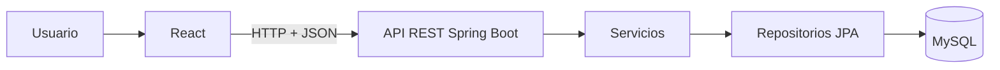

# ZonaFit

ZonaFit es una aplicación para administrar los clientes de un gimnasio. El proyecto evoluciona hacia una API REST construida con Spring Boot y una interfaz web construida con React.

## Problema que resuelve

Los centros de entrenamiento necesitan mantener la información de sus clientes en un único lugar, con operaciones básicas de alta, consulta, edición y eliminación. ZonaFit centraliza esa información y la expone mediante una API que puede ser consumida por distintas interfaces.

## Alcance del MVP

La primera versión incluye:

- Registro de clientes.
- Listado de clientes.
- Búsqueda por ID.
- Edición de clientes.
- Eliminación de clientes.
- Persistencia en MySQL.
- Validación de datos.
- API REST con respuestas JSON.
- Interfaz React para operar el sistema.

El MVP no incluye autenticación, pagos, control de asistencia, rutinas, reportes ni múltiples sedes.

## Arquitectura de alto nivel



El backend separa el transporte HTTP, el servicio de negocio, el acceso a datos y los contratos de entrada y salida. React consumirá la API y no se conectará directamente a la base de datos.

## Requisitos

- JDK 21.
- Maven 3.9 o superior.
- MySQL 8.
- Node.js 18 o superior cuando se integre el frontend React.

## Preparación local

1. Crear la base de datos y la tabla principal:

```sql
CREATE DATABASE zona_fit_db;
USE zona_fit_db;

CREATE TABLE cliente (
    id INT NOT NULL AUTO_INCREMENT,
    nombre VARCHAR(100) NOT NULL,
    apellido VARCHAR(100) NOT NULL,
    membresia INT NOT NULL,
    PRIMARY KEY (id)
);
```

2. Configurar las variables de entorno `DB_URL`, `DB_USERNAME` y `DB_PASSWORD` con los datos locales de MySQL. Por ejemplo, en PowerShell:

   ```powershell
   $env:DB_URL = "jdbc:mysql://localhost:3306/zona_fit_db"
   $env:DB_USERNAME = "root"
   $env:DB_PASSWORD = "tu-password"
   ```

   Los valores por defecto están en `src/main/resources/application.properties`; nunca se deben subir credenciales reales al repositorio.

3. Abrir el proyecto en IntelliJ IDEA como proyecto Maven y esperar la descarga de dependencias.

## Compilar

Con Maven instalado globalmente:

```bash
mvn clean compile
```

Desde IntelliJ IDEA se puede ejecutar la misma tarea desde el panel **Maven**.

## Ejecutar pruebas

```bash
mvn test
```

Las pruebas automatizadas deben utilizar datos de prueba y no la base de datos personal del desarrollador.

## Ejecutar la aplicación

```bash
mvn spring-boot:run
```

También se puede ejecutar directamente la clase `gm.zona_fit.ZonaFitApplication` desde IntelliJ IDEA.

El servidor utiliza el puerto `8080` por defecto. Una verificación rápida del endpoint de lectura es:

```text
GET http://localhost:8080/api/clientes
```

## Documentación

- [Arquitectura](docs/arquitectura.md)
- [Modelo de datos](docs/modelo_datos.md)
- [API REST](docs/api_rest.md)
- [Estrategia de pruebas](docs/estrategia_testing.md)

## Estado actual

La conexión con MySQL, el servidor web y `GET /api/clientes` ya están verificados. El desarrollo de los endpoints restantes, la validación, las pruebas automatizadas y la interfaz React se encuentra en curso.
