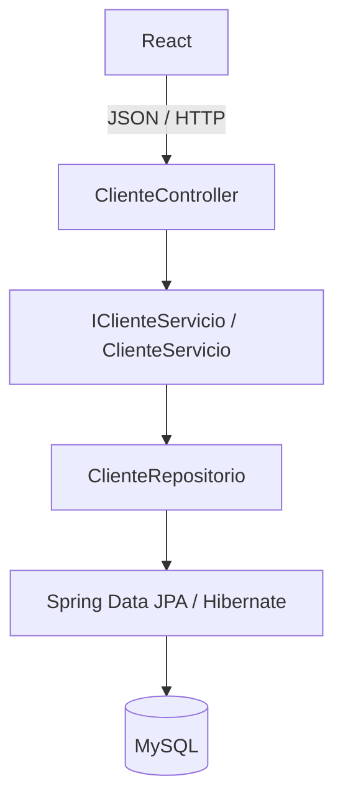

# Arquitectura del sistema

## Propósito

ZonaFit separa la interfaz de usuario, el transporte HTTP, la lógica de negocio y la persistencia. Esta separación permite que el backend pueda ser consumido por React, Postman u otra aplicación sin modificar el dominio.

## Vista de alto nivel

## Capas del backend

| Capa | Paquete o componente | Responsabilidad |
|---|---|---|
| Arranque | `gm.zona_fit.ZonaFitApplication` | Iniciar el contexto de Spring Boot |
| API | `gm.zona_fit.controlador.ClienteController` | Exponer rutas HTTP y códigos de respuesta |
| Contratos | `gm.zona_fit.dto` | Modelar la entrada y salida JSON |
| Servicio | `gm.zona_fit.servicio` | Definir y ejecutar operaciones de negocio |
| Persistencia | `gm.zona_fit.repositorio` | Consultar y modificar la base de datos |
| Dominio | `gm.zona_fit.modelo.Cliente` | Representar la información persistida |

## Responsabilidades

### Controlador

`ClienteController` no debe contener reglas de negocio. Su trabajo es:

- Recibir parámetros de ruta y cuerpos JSON.
- Validar el formato de la solicitud cuando se incorpore Bean Validation.
- Invocar el servicio correspondiente.
- Convertir entidades en DTOs de respuesta.
- Definir códigos HTTP y errores.

### Servicio

`IClienteServicio` define el contrato de operaciones y `ClienteServicio` las implementa. Esta capa es el lugar indicado para las reglas de negocio y para coordinar varias operaciones de persistencia.

### Repositorio

`ClienteRepositorio` extiende `JpaRepository<Cliente, Integer>`. Spring Data genera la implementación de los métodos estándar:

- `findAll()`.
- `findById()`.
- `save()`.
- `delete()`.

### DTOs

La API utiliza dos contratos:

- `ClienteRequest`: datos recibidos para crear o actualizar.
- `ClienteResponse`: datos devueltos al cliente.

La entidad JPA no se expone directamente como respuesta de la API.

## Flujo de lectura

1. React envía `GET /api/clientes`.
2. `ClienteController` recibe la petición.
3. El controlador llama a `ClienteServicio.listarClientes()`.
4. El servicio consulta `ClienteRepositorio`.
5. Hibernate ejecuta la consulta sobre MySQL.
6. El controlador convierte cada entidad `Cliente` en `ClienteResponse`.
7. Spring Boot serializa la lista como JSON.

## Flujo de creación

1. React envía `POST /api/clientes` con un `ClienteRequest`.
2. Spring convierte el JSON en un objeto de entrada.
3. El controlador crea la entidad de dominio.
4. `ClienteServicio` la guarda mediante el repositorio.
5. MySQL genera el identificador.
6. La API responde con `201 Created` y un `ClienteResponse`.

## Configuración

La configuración de base de datos reside en `src/main/resources/application.properties`. La aplicación debe ejecutarse en modo `servlet` para que Spring Boot inicie Tomcat.

Las credenciales deben externalizarse para el despliegue profesional mediante variables de entorno o perfiles de configuración. El proyecto no debe versionar contraseñas reales.

## Frontera con el frontend

React es una aplicación independiente y se comunica únicamente mediante la API. Durante el desarrollo local puede utilizarse un proxy para reenviar las rutas `/api` al backend en el puerto `8080`.

## Decisiones de diseño

- Spring Boot como base del backend.
- API REST con prefijo `/api`.
- DTOs para proteger el contrato de la base de datos.
- MySQL como persistencia del MVP.
- React como interfaz web.
