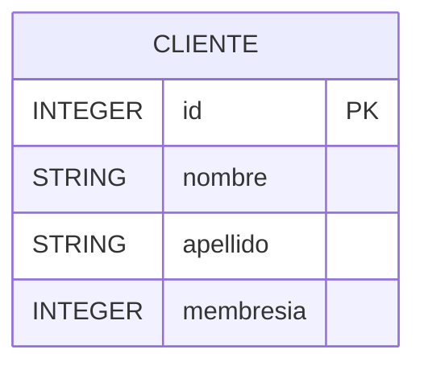
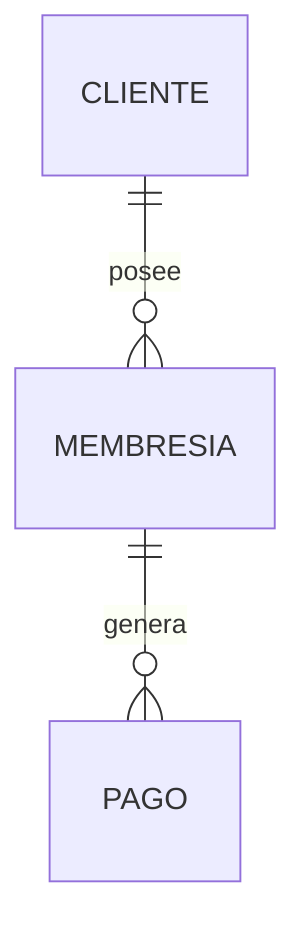

# Modelo de datos

## Alcance del dominio

El MVP representa únicamente a los clientes del gimnasio. La entidad `Cliente` es deliberadamente simple para evitar introducir conceptos de planes, pagos o suscripciones antes de que existan reglas de negocio definidas.

## Entidad `Cliente`

| Atributo | Tipo JPA | Restricción | Descripción |
|---|---|---|---|
| `id` | `Integer` | Clave primaria, autogenerada | Identificador del cliente |
| `nombre` | `String` | Obligatorio | Nombre del cliente |
| `apellido` | `String` | Obligatorio | Apellido del cliente |
| `membresia` | `Integer` | Obligatorio | Código o número de membresía |

El identificador se genera mediante `GenerationType.IDENTITY`. El cliente que consume la API no debe enviar un `id` al crear un registro.

## Reglas de dominio

- El nombre no puede ser nulo ni contener solamente espacios.
- El apellido no puede ser nulo ni contener solamente espacios.
- La membresía debe ser válida según las reglas del negocio.
- No se puede modificar ni eliminar un cliente que no existe.
- El `id` es generado y gestionado por la base de datos.

Las anotaciones de validación se incorporarán en la capa de DTOs para no acoplar las reglas de la API directamente a la entidad JPA.

## Diagrama entidad-relación



## Relaciones actuales

El modelo actual contiene una única entidad y no tiene relaciones entre entidades. Esta decisión es intencional para el MVP.

Una relación no debe agregarse únicamente porque el dominio crece. Primero debe existir una regla de negocio clara que justifique la nueva entidad.

## Persistencia

El proyecto utiliza Spring Data JPA y Hibernate. La aplicación no crea el esquema automáticamente porque `spring.jpa.hibernate.ddl-auto=none`.

La tabla base puede inicializarse manualmente con la siguiente definición mínima:

```sql
CREATE DATABASE zona_fit_db;
USE zona_fit_db;

CREATE TABLE cliente (
    id INT NOT NULL AUTO_INCREMENT,
    nombre VARCHAR(100) NOT NULL,
    apellido VARCHAR(100) NOT NULL,
    membresia INT NOT NULL,
    PRIMARY KEY (id)
);
```

## Evolución futura

Las siguientes entidades son posibles, pero quedan fuera del MVP:

| Entidad futura | Propósito |
|---|---|
| `Membresia` | Representar planes, precios y duración |
| `Pago` | Registrar pagos de clientes |
| `Asistencia` | Registrar visitas al gimnasio |

Una futura relación podría ser:



## Consideraciones de diseño

- La entidad `Cliente` no se expone directamente como respuesta JSON.
- Los DTOs permiten controlar qué datos pueden enviarse o recibirse.
- El nombre de la tabla y las columnas deben confirmarse contra el esquema realmente desplegado.
- Las migraciones versionadas reemplazarán la creación manual de tablas en una iteración posterior.
